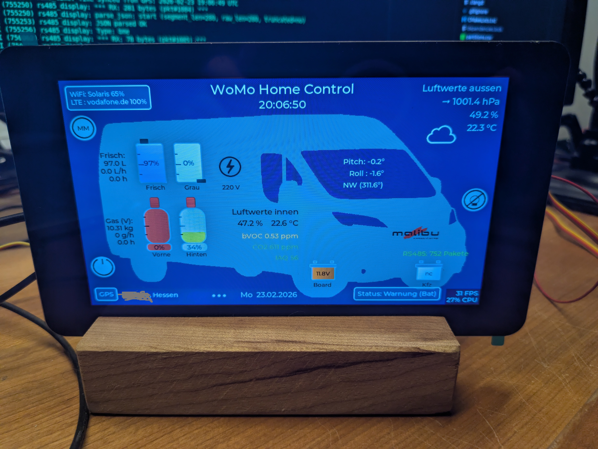
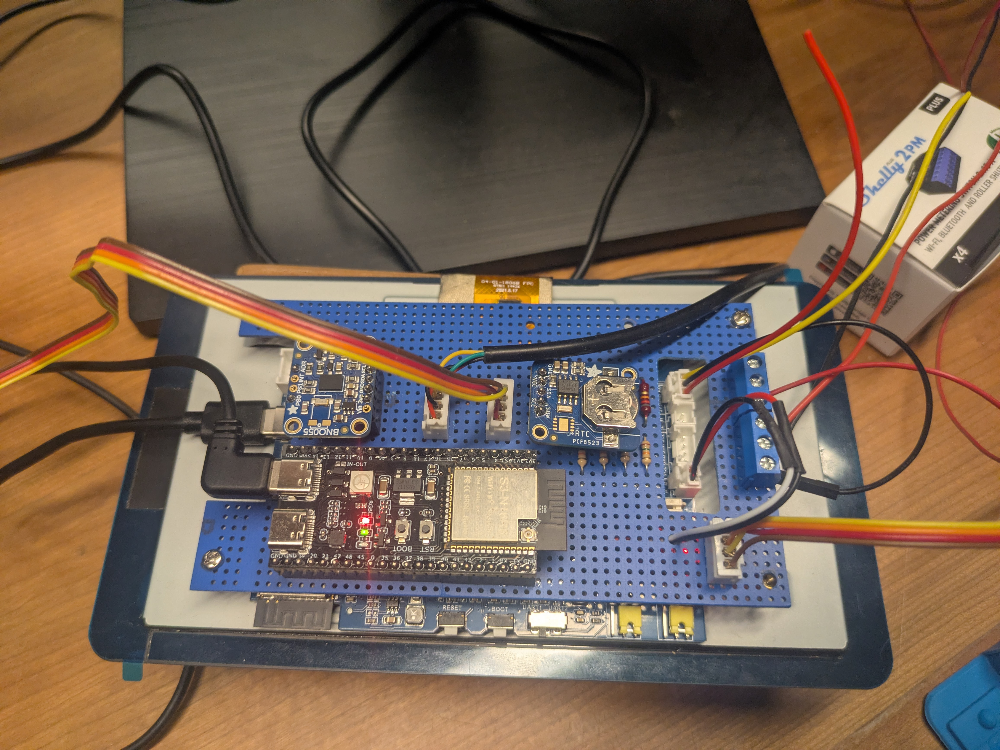

# WoMo Home ESP32 – Bordcomputer für's Wohnmobil

> Alle wichtigen Betriebsdaten auf einen Blick – immer wissen, was im Fahrzeug los ist.

## 🚐 Worum geht es?

Wer mit dem Wohnmobil unterwegs ist, kennt das Problem: Wie viel Gas ist noch in der Flasche? Reicht der Strom? Ist der Frischwassertank bald leer? Wie kalt wird es draußen über Nacht? Die serienmäßigen Anzeigen im Fahrzeug sind oft ungenau, schlecht ablesbar oder schlicht nicht vorhanden.

**WoMo Home** ersetzt das klassische EBL-Panel durch ein selbstgebautes System, das alle Betriebsdaten des Wohnmobils erfasst, intelligent aufbereitet und auf einem 7-Zoll-Touchdisplay darstellt – jederzeit aktuell, übersichtlich und von überall im Fahrzeug erreichbar.

## 🎯 Was wird überwacht?

### Energie
- **Bordbatterie & Starterbatterie** – Spannung, Ladezustand
- **Landstrom** – Erkennung, ob 230V angeschlossen sind
- **12V-Bordnetz** – Ein/Aus per Touch, Übersicht aller Verbraucher

### Gas
- **Füllstandsmessung per Waage** – Zwei Gasflaschen, Anzeige in kg und Prozent
- **Verbrauchsberechnung** – Hochrechnung „Wie lange reicht das Gas noch?" auf Basis der letzten Stunden
- **Flaschenwechsel-Erkennung** – Automatisches Zurücksetzen beim Tausch

### Wasser
- **Frischwasser** und **Grauwasser** – Pegelstand in Prozent und Litern
- **Verbrauchstrend** – Restlaufzeit-Prognose

### Klima & Umgebung
- **Innenraumklima** – Temperatur, Luftfeuchte, Luftqualität (IAQ)
- **Außenklima** – Temperatur, Luftfeuchte, Luftdrucktrend
- **Wettervorhersage** – (todo) Aktuelles Wetter und 3-Tage-Prognose vom Internet
- **Unwetterwarnungen** – Automatisch vom europäischen Meteoalarm-System

### Navigation & Lage
- **GPS-Position** – Standort, Geschwindigkeit, Höhe über dem Router
- **Kompass & Neigung** – Fahrzeugausrichtung, Pitch/Roll (Nivellierung beim Aufstellen)
- **Reverse Geocoding** – Automatische Ortsbestimmung (z. B. „Berchtesgaden, Bayern")

### Konnektivität
- **WLAN** – Verbindung zu Campingplatz-Netzen oder Hotspots
- **LTE** – Mobiles Internet über den Router
- **Hotspot** – Eigenes WLAN für alle Geräte im Fahrzeug
- Steuerung und Statusanzeige direkt am Touchscreen

## 🏗️ Wie ist das System aufgebaut?

Das System besteht aus drei Komponenten:

**Sensorboard** – Ein kleiner Mikrocontroller, der sämtliche Sensoren und Aktoren bedient: Waagen, Temperatursensoren, Batteriespannungen, Tankpegel, Kompass. Er sitzt versteckt hinter dem EBL-Schrank und ersetzt dort das originale Anzeigepanel.

**Touchdisplay** – Ein 7-Zoll-Farbbildschirm mit Touch, eingebaut an einer gut sichtbaren Stelle. Hier laufen alle Informationen zusammen und werden grafisch aufbereitet. Über den Touchscreen lassen sich auch Funktionen steuern (Bordnetz ein/aus, Radio, WLAN).

**Router** – Hier ein Teltonika RUTX11 sorgt für die Verbindung zur Außenwelt: LTE-Internet unterwegs, WLAN auf dem Campingplatz, GPS-Ortung und ein eigener Hotspot für Laptops und Smartphones an Bord. Wurde gewählt wegen der Anschlußmöglichkeiten der Antennen auf dem Womo Dach.

Sensorboard und Display kommunizieren über einen RS485-Bus

## 💡 Warum selbst bauen?

- **Genauigkeit** – Die Gasflaschen-Waage zeigt den Füllstand in Gramm statt „irgendwo zwischen halb und voll". Die Tankpegel werden kalibriert statt geschätzt.
- **Alles an einem Ort** – Kein Aufstehen mehr, um am EBL-Panel nachzuschauen. Kein separates Thermometer, keine Extra-App für den Router.
- **Intelligente Prognosen** – Das System rechnet mit: Wie lange reicht das Gas bei aktuellem Verbrauch? Wann ist der Tank leer? Wie entwickelt sich der Luftdruck?
- **Offenes System** – Komplett Open Source auf ESP32-Basis. Erweiterbar, anpassbar, reparierbar. Kein Cloud-Zwang, keine Abo-Kosten.
- **Robustheit** – Industriekomponenten (RS485, Metallgehäuse-Router), für den 12V-Betrieb ausgelegt. Funktioniert auch ohne Internet.
- **Weil es Spass macht und so noch nicht gibt.**

## 📁 Projektstruktur

```
womo-home-esp32/
├── firmware/
│   ├── display/            ← Firmware für das Touchdisplay
│   └── sensorboard/        ← Firmware für das Sensorboard
├── hardware/
│   ├── schematics/          ← Schaltpläne
│   └── datasheets/          ← Datenblätter der Komponenten
├── docs/                    ← Ausführliche Dokumentation
└── tests/                   ← Einzelne Hardware-Tests
```

Technische Details (Pinbelegungen, Protokoll, Build-Anleitung) finden sich in den jeweiligen Unterordnern und in [docs/README.md](docs/README.md).

## 🔧 Entwicklung

Das Projekt nutzt das [Espressif ESP-IDF](https://docs.espressif.com/projects/esp-idf/en/stable/esp32s3/get-started/) Framework. Für jeden Firmware-Teil gibt es einen eigenen VS Code Workspace mit vorkonfigurierten Build/Flash/Monitor-Tasks:

- `womo-sensor.code-workspace` – Sensorboard-Entwicklung
- `womo-display.code-workspace` – Display-Entwicklung

**!!! Ich habe den ganzen Code im Vibe Coding erzeugt !!!**

## 📜 Lizenz

Privates Projekt. Siehe [LICENSE](LICENSE).

## 📸 Aufbau-Fotos (Feb 2026)

| Display (Vorderseite) | Sensorboard (Rückseite) |
|---|---|
|  |  |
